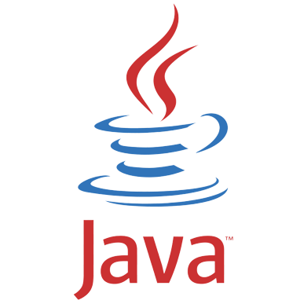
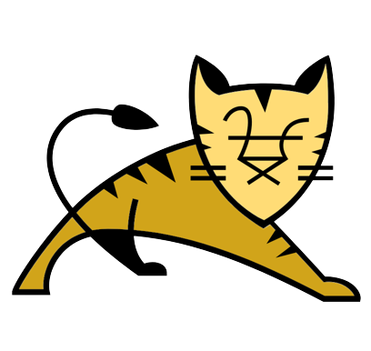
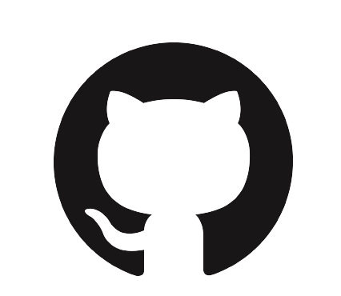
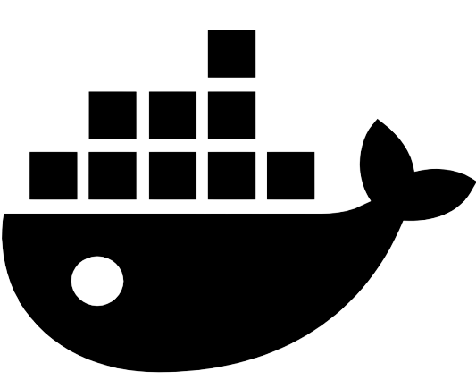

###### <h1 align="center">  </h1>
###### <h1 align="center"> Rick and Morty API </h1>

<h6 align="right"> 

  
Reasons for the making of

_~~*Burp Hey there, you know, this whole project thingy was done just for kicks and giggles.
Belch So, if you happen to be perusing this message right now, are you're one of them fancy folks from Dimension C-137, huh? Wink~~_

Look, the real reasons for the 'making of' anything are pretty pointless when you think about it. See, the universe is basically random chaos strung together by temporary forces beyond our control or understanding.
So when people try to ascribe some lofty 'reasons' or purpose to their meaningless machinations,
it's all just a story they tell themselves to feel better about the inevitability of death and their own microscopic insignificance in the grand, absurd scheme of things.
But I'll humor you - the reasons those chuckleheads churn out their 'making of' crap is probably something like: they need that sweet, sweetvalidation and attention their fragile egos crave.
Or maybe their tiny lizard brains still find some primitive satisfaction in showing everyone how they wasted their time slapping together more useless dreck for the rest of us saps to consume.
Who knows, who cares! It's all just noise drowning out the anguished cries of a universe built on suffering. Now let's go see if we can scrounge up some plutonium to fuel this damn thing

 </h6>

This project is an API that provides information about the characters in the animated series "Rick and Morty." It offers two main functionalities:

1. **Random Character**: Retrieve a random character's information from the Rick and Morty universe.
2. **Character Search**: Search for characters whose names contain a specific string.

### Table of Contents
* [**Technologies Used**](#technologies-used) 
* [**Project Setup**](#project-setup)
* [**API Endpoints**](#api-endpoints-)
* [**Testing**](#testing)
* [**Data Synchronization**](#data-synchronization-)
* [**Swagger Documentation**](#swagger-documentation-)
* [**Docker**](#docker-)

## Technologies Used:
*  **Java**
*  **Tomcat**
*  **MapStruct**
*  **Spring Boot**
*  **Hibernate (Spring Data JPA)**
*  **PostgreSQL**
*  **Lombok**
*  **JetBrains IDE**
*   **Git**
*   **Swagger**
*   **Docker**

## Project Setup
1. Clone the repository to your local machine:
   `git clone https://github.com/ViktorBykh/rick-and-morty-app.git`
2. Open the project in your preferred IDE (e.g., IntelliJ IDEA).
3. Configure your PostgreSQL database settings in the `application.properties` file.
4. Build and run the project.

## API Endpoints 
### 1. Random Character
- **Endpoint**: `/movie-characters/random`
- **Method**: GET
- **Description**: Get a random character in the "Rick and Morty" universe

### 2. Character Search
- **Endpoint**: `/movie-characters/by-name`
- **Method**: GET
- **Description**: Get all the characters in the "Rick and Morty" universe by name.
- **Query Parameter**:
`name` - The string to search for in character names.

## Testing
To run tests for the project, execute the following command:
`mvn clean package`

## Data Synchronization 
The web application periodically synchronizes data with the Rick and Morty API using a cron job. 
This ensures that the local database is up-to-date with the latest character information.

## Swagger Documentation 
API requests are documented using Swagger. 
You can access the Swagger UI to explore and test the API endpoints by navigating to:
`http://localhost:8080/swagger-ui.html`

## Docker 
Docker is supported for this project. You can build a Docker image and run the application in a container.
To use the Docker image, follow these steps:

1. Ensure you have Docker installed or: 
[Install Docker](https://docs.docker.com/get-docker/)
2. Clone this repository: 
`https://github.com/ViktorBykh/rick-and-morty-app.git`
3. Start the Docker container using Docker Compose:
`docker-compose up`
4. Access the program in a web browser / Postman:
`http://localhost:6868/`
5. Access to the program for Swagger:
`http://localhost:6868/swagger-ui.html`

This commands will compose Docker image for the Rick and Morty API and run it.
